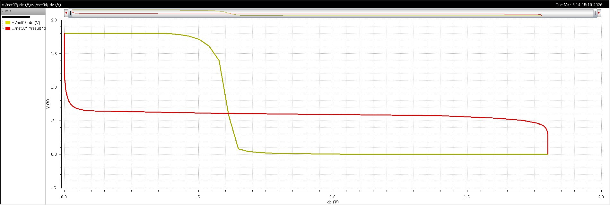
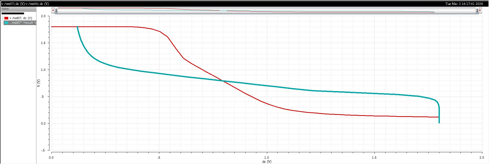
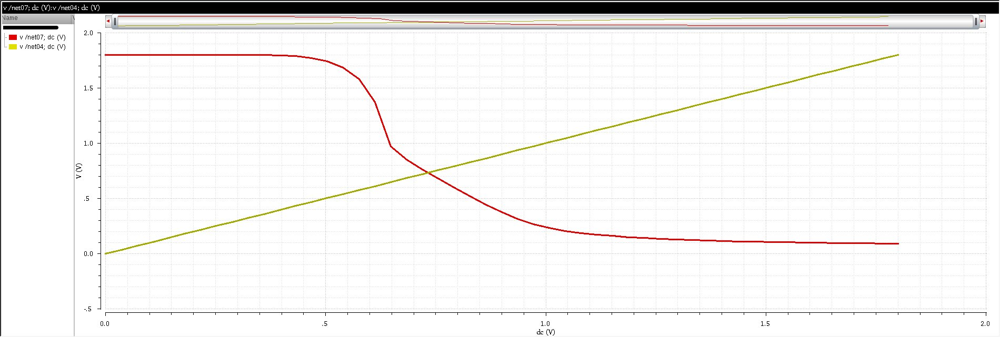
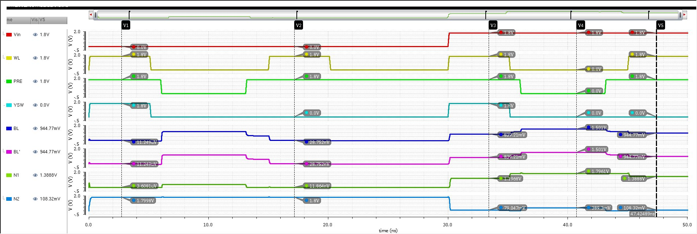

# 6T SRAM Cell

A **6-Transistor (6T) SRAM cell** designed and simulated in Cadence Virtuoso using TSMC 180nm technology. The project includes full Static Noise Margin (SNM) analysis for Hold, Read, and Write operations.

---

## Specifications

| Parameter | Value |
|-----------|-------|
| Supply Voltage (VDD) | 1.8V |
| Technology Node | 180nm TSMC |
| Cell Type | 6T (6 Transistor) SRAM |
| Simulator | Spectre (ADE L) |
| Analysis | SNM — Hold, Read, Write |

---

## Simulation Results

### Hold SNM — Butterfly Curve

Butterfly curve during hold state (WL = 0). The SNM is measured as the side of the largest square that fits inside the lobes.

### Read SNM — Butterfly Curve

Butterfly curve during read operation (WL = 1, BL = BLB = VDD). Read SNM is lower than Hold SNM due to voltage disturbance on storage node.

### Write SNM — Butterfly Curve

Write margin analysis showing the ability to flip the cell state during a write operation.

### Write/Read Transient — 0→1 Operation

Transient simulation showing successful Write 0→1 followed by Read operation, with BL, BLB, WL, Q and QB waveforms.

---

## Design Notes

- **6T topology** chosen for its balance of area, stability, and read/write performance
- **SNM analysis** performed for all three states: Hold, Read, and Write
- Read SNM is intentionally lower than Hold SNM — a known tradeoff in 6T design
- Write operation verified through transient simulation showing correct bit-flip behavior
- Simulated using **Spectre** via **ADE L** in Cadence Virtuoso

---

## Future Improvements

- [ ] Add process corner simulations (TT, FF, SS)
- [ ] Monte Carlo analysis for SNM variation
- [ ] Design and integrate Sense Amplifier for full SRAM bitcell operation
- [ ] Explore 8T SRAM for improved read stability
